## Task 1

> Explain how the load balancer behaves when you open and refresh the URL http://192.168.42.42 in your browser. Add screenshots to complement your explanations. We expect that you take a deeper a look at session management.

The first result when we call 192.168.42.42.

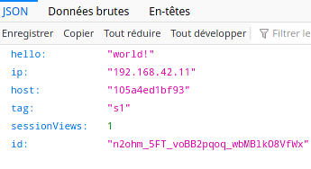

After we refresh the page, we can see it's the other server that responds.

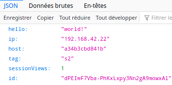

Currently, there are no sessions and we can see after some refreshes that the sessionsViews are still 1 and don't increment. Cookies set by each servers are ignored by the load-balancer for the moment and because of that they cannot maintain a state between connections. This is because HTTP is a stateless protocol separated from TCP connections. We need cookies to identify the client and maintain a state between HTTP connections. The problem is if the server isn't the same, the cookie previously set is unknown to it.

> Explain what should be the correct behavior of the load balancer for session management.

Normally, if sessions are successfully enabled, we should communicate with the same server every times after refreshing the page and the sessionsView counter should increment.

> Provide a sequence diagram to explain what is happening when one requests the URL for the first time and then refreshes the page. We want to see what is happening with the cookie. We want to see the sequence of messages exchanged (1) between the browser and HAProxy and (2) between HAProxy and the nodes S1 and S2. 

```sequence
participant Browser as b
participant HAProxy as h
participant S1 as s1
participant S2 as s2
b->h:GET /\nHOST:192.168.42.42 
h->s1:GET /\nHOST:192.168.42.11:3000
s1->h: {hello: "world!",...}
h->b: {hello: "world!",...}

b->h:GET /\nHOST:192.168.42.42 
h->s2:GET /\nHOST:192.168.42.22:3000
s2->h: {hello: "world!",...}
h->b: {hello: "world!",...}
```

> Provide a screenshot of the summary report from JMeter.

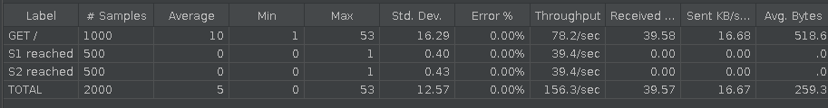

> Clear the results in JMeter and re-run the test plan. Explain what is happening when only one node remains active. Provide another sequence diagram using the same model as the previous one.

As the server 1 is down, the load-balancer will redirect requests to the remaining alive servers, only S2 in our case.

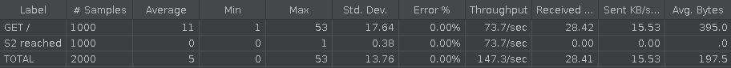

```sequence
participant Browser as b
participant HAProxy as h
participant S2 as s2
participant S1 as s1

b->h:GET /\nHOST:192.168.42.42 
h->s2:GET /\nHOST:192.168.42.22:3000
s2->h: {hello: "world!",...}
h->b: {hello: "world!",...}

b->h:GET /\nHOST:192.168.42.42 
h->s2:GET /\nHOST:192.168.42.22:3000
s2->h: {hello: "world!",...}
h->b: {hello: "world!",...}
```


## Task 2

> There is different way to implement the sticky session. One possibility is to use the SERVERID provided by HAProxy. Another way is to use the  NODESESSID provided by the application. Briefly explain the difference between both approaches (provide a sequence diagram with cookies to show the difference).

With the SERVERID method, HAProxy add a separate cookie called SERVERID that identify the server. It's this cookie that's used to choose which server to request.

```sequence
participant Browser as b
participant HAProxy as h
participant S1 as s1
b->h:GET /
h->s1:GET /
s1->h: Set-Cookie:NODESESSID=abc
h->b: Set-Cookie:SERVERID=s1;NODESESSID=abc
b->h:GET /\nCookie:SERVERID=s1;NODESESSID=abc
h->s1:GET /\nCookie:NODESESSID=abc
s1->h: Set-Cookie:NODESESSID=abc
h->b: Set-Cookie:SERVERID=s1;NODESESSID=abc
```

The second method is very similar but HAProxy doesn't use a separate cookie but insert the server ID in the cookie already used by the application, NODESESSID in our case. The `~` is used to separate from the server ID from the cookie value the application. The `S1~` is remove before reaching the final server so the application sees no difference.

```sequence
participant Browser as b
participant HAProxy as h
participant S1 as s1
b->h:GET /
h->s1:GET /
s1->h: Set-Cookie:NODESESSID=abc
h->b: Set-Cookie:NODESESSID=S1~abc
b->h:GET /\nCookie:NODESESSID=S1~abc
h->s1:GET /\nCookie:NODESESSID=abc
s1->h: Set-Cookie:NODESESSID=abc
h->b: Set-Cookie:NODESESSID=S1~abc
```


> Provide the modified `haproxy.cfg` file with a short explanation of the modifications you did to enable sticky session management.

```
backend nodes
	# Set SERVERID cookie for sticky-session
    cookie SERVERID insert indirect nocache

    # Define the list of nodes to be in the balancing mechanism
    # http://cbonte.github.io/haproxy-dconv/2.2/configuration.html#4-server
    server s1 ${WEBAPP_1_IP}:3000 check cookie s1
    server s2 ${WEBAPP_2_IP}:3000 check cookie s2
```

> Explain what is the behavior when you open and refresh the URL http://192.168.42.42 in your browser. Add screenshots to complement your explanations. We expect that you take a deeper a look at session management.

Now we have responses from the same server every time we refresh the page and we can see the sessionViews counter increments. The session is correctly maintain between HTTP request due to the SERVERID cookie.

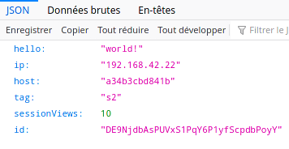

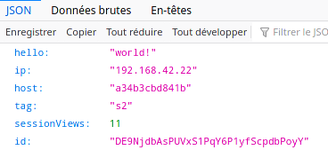

> Provide a sequence diagram to explain what is happening when one requests the URL for the first time and then refreshes the page. We want to see what is happening with the cookie. We want to see the sequence of messages exchanged (1) between the browser and HAProxy and (2) between HAProxy and the nodes S1 and S2. We also want to see what is happening when a second browser is used.

```sequence
participant Browser 1 as b
participant Browser 2 as b2
participant HAProxy Frontend as hf
participant HAProxy Backend as hb
participant S1 as s1
participant S2 as s2
b->hf:GET /
hf->hb: Choose the server
hb->s1:GET /
s1->hb: Set-Cookie:NODESESSID=abc
hb->hf: Define a SERVERID cookie
hf->b:Set-Cookie:SERVERID=s1;NODESESSID=abc
b2->hf:GET /
hf->hb: Choose the server
hb->s2:GET /
s2->hb: Set-Cookie:NODESESSID=efg
hb->hf: Define a SERVERID cookie\nfor the new browser
hf->b2:Set-Cookie:SERVERID=s2;NODESESSID=efg
```

> Provide a screenshot of JMeter's summary report. Is there a difference with this run and the run of Task 1?

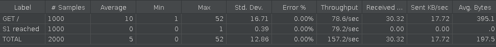

We can see all requests reached the server S1 while, in task 1, requests were split between S1 and S2.

> Provide a screenshot of JMeter's summary report. Give a short explanation of what the load balancer is doing.

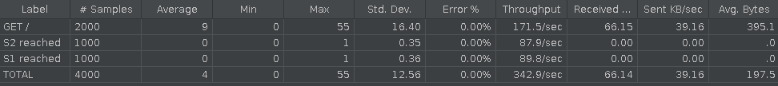

The load-balancer choose a server for the first thread (user) and keep reaching the same server for this user for the next requests (999). Same for the second user. In this case, the second server is chosen and kept for all future requests (999). That's why there are 1000 requests for each server.

## Task 3

> Take a screenshot of the Step 5 and tell us which node is answering.

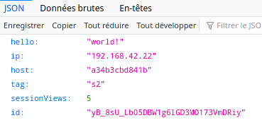

S2 is answering for the moment.

> Based on your previous answer, set the node in DRAIN mode. Take a screenshot of the HAProxy state page.

```powershell
> set server nodes/s2 state drain
```

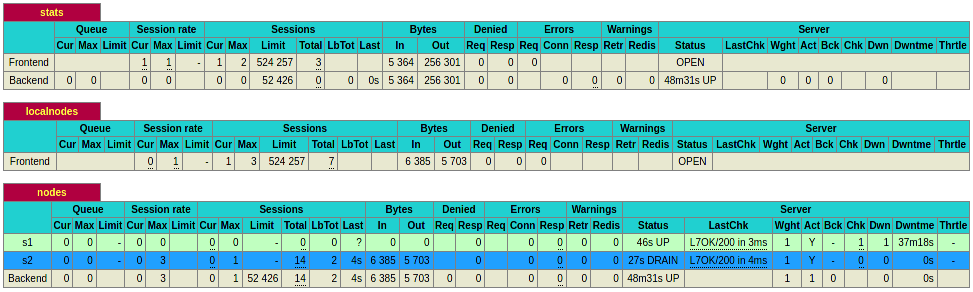

> Refresh your browser and explain what is happening. Tell us if you stay on the same node or not. If yes, why? If no, why?

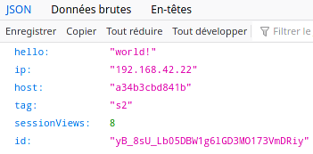

We can see we still reach S2 because, as explained in the README, DRAIN mode only prevent new connections on S2 but already established sessions are still authorized.

> Open another browser and open `http://192.168.42.42`. What is happening?

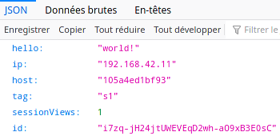

We reach the node S1 which isn't in drain mode.

> Clear the cookies on the new browser and repeat these two steps multiple times. What is happening? Are you reaching the node in DRAIN mode?

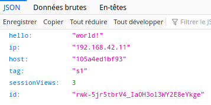

We can see it's a new session because the id is different. We still reach S1. We do not reach the DRAIN node anymore for new sessions.

> Reset the node in READY mode. Repeat the three previous steps and explain what is happening. Provide a screenshot of HAProxy's stats page.

```shell
> set server nodes/s2 state ready
```

Request in a new browser :

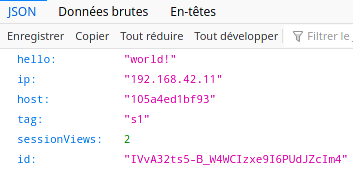

After clearing the cookies :

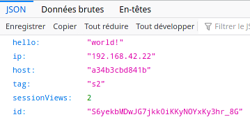

We can reach S2 again with new session because it's back in ready mode.

> Finally, set the node in MAINT mode. Redo the three same steps and explain what is happening. Provide a screenshot of HAProxy's stats page.

```
> set server nodes/s2 state maint
```

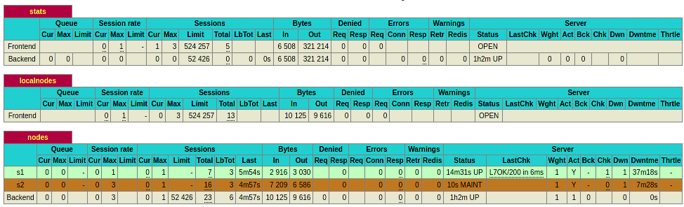

Even already established sessions are ignored and all traffic is redirected to S1, the only active node.

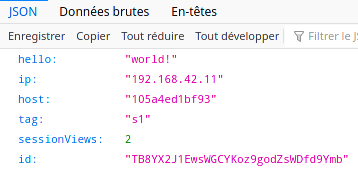

Request on another browser :

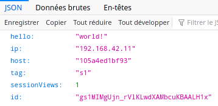