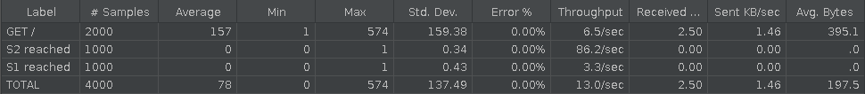
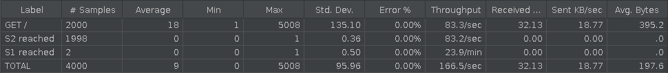
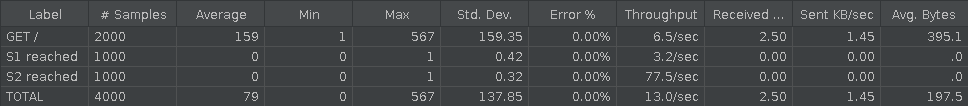
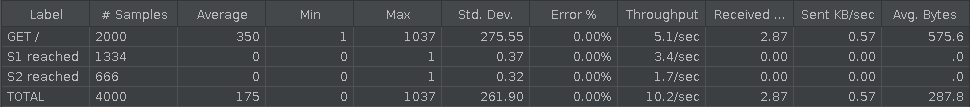
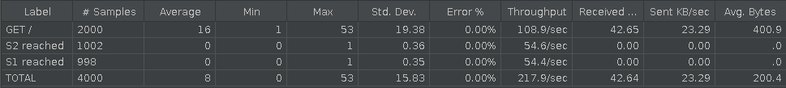
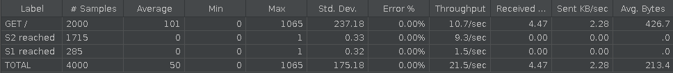
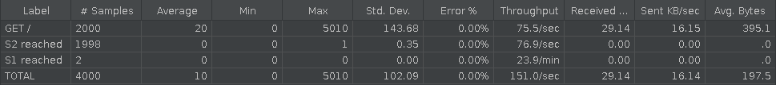
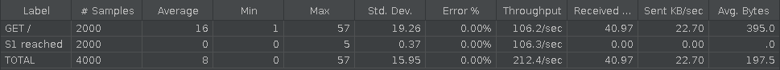
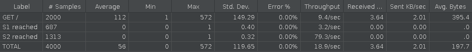

# AIT : Labo 03 - Load balancing

> Author : Gil Balsiger & Julien Béguin
>
> Date : 30.11.2020


## Introduction

The purpose of this laboratory is to take a look at HAProxy and to experiment multiple configuration on this load-balancer. Additionally, we will use JMeter to test and verify that out configuration works properly under load.

**Summary :**

1. round-robin balance mode
2. sticky session management
3. drain mode (node management)
4. unhealthy node management
5. leastconn balance mode
6. first balance mode


## Task 1: Install the tools

> Explain how the load balancer behaves when you open and refresh the URL http://192.168.42.42 in your browser. Add screenshots to complement your explanations. We expect that you take a deeper a look at session management.

The first result when we call 192.168.42.42.


After we refresh the page, we can see it's the other server that responds.


Currently, there are no sessions and we can see after some refreshes that the sessionsViews are still 1 and don't increment. Cookies set by each servers are ignored by the load-balancer for the moment and because of that they cannot maintain a state between connections. This is because HTTP is a stateless protocol separated from TCP connections. We need cookies to identify the client and maintain a state between HTTP connections. The problem is if the server isn't the same, the cookie previously set is unknown to it.

> Explain what should be the correct behavior of the load balancer for session management.

Normally, if sessions are successfully enabled, we should communicate with the same server every times after refreshing the page and the sessionsView counter should increment.

> Provide a sequence diagram to explain what is happening when one requests the URL for the first time and then refreshes the page. We want to see what is happening with the cookie. We want to see the sequence of messages exchanged (1) between the browser and HAProxy and (2) between HAProxy and the nodes S1 and S2. 

```sequence
participant Browser as b
participant HAProxy as h
participant S1 as s1
participant S2 as s2
b->h:GET /\nHOST:192.168.42.42 
h->s1:GET /\nHOST:192.168.42.11:3000
s1->h: {hello: "world!",...}
h->b: {hello: "world!",...}

b->h:GET /\nHOST:192.168.42.42 
h->s2:GET /\nHOST:192.168.42.22:3000
s2->h: {hello: "world!",...}
h->b: {hello: "world!",...}
```

> Provide a screenshot of the summary report from JMeter.


> Clear the results in JMeter and re-run the test plan. Explain what is happening when only one node remains active. Provide another sequence diagram using the same model as the previous one.

As the server 1 is down, the load-balancer will redirect requests to the remaining alive servers, only S2 in our case.


```sequence
participant Browser as b
participant HAProxy as h
participant S2 as s2
participant S1 as s1

b->h:GET /\nHOST:192.168.42.42 
h->s2:GET /\nHOST:192.168.42.22:3000
s2->h: {hello: "world!",...}
h->b: {hello: "world!",...}

b->h:GET /\nHOST:192.168.42.42 
h->s2:GET /\nHOST:192.168.42.22:3000
s2->h: {hello: "world!",...}
h->b: {hello: "world!",...}
```


## Task 2: Sticky sessions

> There is different way to implement the sticky session. One possibility is to use the SERVERID provided by HAProxy. Another way is to use the  NODESESSID provided by the application. Briefly explain the difference between both approaches (provide a sequence diagram with cookies to show the difference).

With the SERVERID method, HAProxy add a separate cookie called SERVERID that identify the server. It's this cookie that's used to choose which server to request.

```sequence
participant Browser as b
participant HAProxy as h
participant S1 as s1
b->h:GET /
h->s1:GET /
s1->h: Set-Cookie:NODESESSID=abc
h->b: Set-Cookie:SERVERID=s1;NODESESSID=abc
b->h:GET /\nCookie:SERVERID=s1;NODESESSID=abc
h->s1:GET /\nCookie:NODESESSID=abc
s1->h: Set-Cookie:NODESESSID=abc
h->b: Set-Cookie:SERVERID=s1;NODESESSID=abc
```

The second method is very similar but HAProxy doesn't use a separate cookie but insert the server ID in the cookie already used by the application, NODESESSID in our case. The `~` is used to separate from the server ID from the cookie value the application. The `S1~` is remove before reaching the final server so the application sees no difference.

```sequence
participant Browser as b
participant HAProxy as h
participant S1 as s1
b->h:GET /
h->s1:GET /
s1->h: Set-Cookie:NODESESSID=abc
h->b: Set-Cookie:NODESESSID=S1~abc
b->h:GET /\nCookie:NODESESSID=S1~abc
h->s1:GET /\nCookie:NODESESSID=abc
s1->h: Set-Cookie:NODESESSID=abc
h->b: Set-Cookie:NODESESSID=S1~abc
```


> Provide the modified `haproxy.cfg` file with a short explanation of the modifications you did to enable sticky session management.

```
backend nodes
	# Set SERVERID cookie for sticky-session
    cookie SERVERID insert indirect nocache

    # Define the list of nodes to be in the balancing mechanism
    # http://cbonte.github.io/haproxy-dconv/2.2/configuration.html#4-server
    server s1 ${WEBAPP_1_IP}:3000 check cookie s1
    server s2 ${WEBAPP_2_IP}:3000 check cookie s2
```

> Explain what is the behavior when you open and refresh the URL http://192.168.42.42 in your browser. Add screenshots to complement your explanations. We expect that you take a deeper a look at session management.

Now we have responses from the same server every time we refresh the page and we can see the sessionViews counter increments. The session is correctly maintain between HTTP request due to the SERVERID cookie.


> Provide a sequence diagram to explain what is happening when one requests the URL for the first time and then refreshes the page. We want to see what is happening with the cookie. We want to see the sequence of messages exchanged (1) between the browser and HAProxy and (2) between HAProxy and the nodes S1 and S2. We also want to see what is happening when a second browser is used.

```sequence
participant Browser 1 as b
participant Browser 2 as b2
participant HAProxy Frontend as hf
participant HAProxy Backend as hb
participant S1 as s1
participant S2 as s2
b->hf:GET /
hf->hb: Choose the server
hb->s1:GET /
s1->hb: Set-Cookie:NODESESSID=abc
hb->hf: Define a SERVERID cookie
hf->b:Set-Cookie:SERVERID=s1;NODESESSID=abc
b2->hf:GET /
hf->hb: Choose the server
hb->s2:GET /
s2->hb: Set-Cookie:NODESESSID=efg
hb->hf: Define a SERVERID cookie\nfor the new browser
hf->b2:Set-Cookie:SERVERID=s2;NODESESSID=efg
```

> Provide a screenshot of JMeter's summary report. Is there a difference with this run and the run of Task 1?


We can see all requests reached the server S1 while, in task 1, requests were split between S1 and S2.

> Provide a screenshot of JMeter's summary report. Give a short explanation of what the load balancer is doing.


The load-balancer choose a server for the first thread (user) and keep reaching the same server for this user for the next requests (999). Same for the second user. In this case, the second server is chosen and kept for all future requests (999). That's why there are 1000 requests for each server.


## Task 3: Drain mode

> Take a screenshot of the Step 5 and tell us which node is answering.


S2 is answering for the moment.

> Based on your previous answer, set the node in DRAIN mode. Take a screenshot of the HAProxy state page.

```powershell
> set server nodes/s2 state drain
```


> Refresh your browser and explain what is happening. Tell us if you stay on the same node or not. If yes, why? If no, why?


We can see we still reach S2 because, as explained in the README, DRAIN mode only prevent new connections on S2 but already established sessions are still authorized.

> Open another browser and open `http://192.168.42.42`. What is happening?


We reach the node S1 which isn't in drain mode.

> Clear the cookies on the new browser and repeat these two steps multiple times. What is happening? Are you reaching the node in DRAIN mode?


We can see it's a new session because the id is different. We still reach S1. We do not reach the DRAIN node anymore for new sessions.

> Reset the node in READY mode. Repeat the three previous steps and explain what is happening. Provide a screenshot of HAProxy's stats page.

```shell
> set server nodes/s2 state ready
```

Request in a new browser :


After clearing the cookies :


We can reach S2 again with new session because it's back in ready mode.

> Finally, set the node in MAINT mode. Redo the three same steps and explain what is happening. Provide a screenshot of HAProxy's stats page.

```
> set server nodes/s2 state maint
```


Even already established sessions are ignored and all traffic is redirected to S1, the only active node.


Request on another browser :


## Task 4: Round robin in degraded mode

> 1. Make sure a delay of 0 milliseconds is set on `s1`. Do a run to have a baseline to compare with in the next experiments.

Reset delay on `s1` :

```bash
curl -H "Content-Type: application/json" -X POST -d '{"delay": 0}' http://192.168.42.11:3000/delay
```

JMeter result :


> 2. Set a delay of 250 milliseconds on `s1`. Relaunch a run with the JMeter script and explain what is happening.

Set delay on `s1` :

```bash
curl -H "Content-Type: application/json" -X POST -d '{"delay": 250}' http://192.168.42.11:3000/delay
```

JMeter result :



As expected, `s1` is much slower to answer as we can see on the *Throughput* column. `s1` served **3.3** requests per second while `s2` served **86.2** requests per sec.

Requests are still distributed between between `s1` and `s2`. 


> 3. Set a delay of 2500 milliseconds on `s1`. Same than previous step.

```bash
curl -H "Content-Type: application/json" -X POST -d '{"delay": 2500}' http://192.168.42.11:3000/delay
```

JMeter result :



This time, only 2 requests reached `s1`. This is due to the load-balancer checking backend server's health.

The load-balancer frequently check backend's health and must have considered `s1` unhealthy by his overly slow response. If `s1` is considered unhealthy, it is removed from the pool of backend until it is healthy again. Meanwhile, all traffic is redirected to `s2`.


> 4. In the two previous steps, are there any errors? Why?

No because the load-balancer did his job. When it detected that `s1` was an unhealthy backend, he removed it from the pool and redirected all traffic to an healthy backend, `s2`. This way, no request add an error.


> 5. Update the HAProxy configuration to add a weight to your nodes. For that, add `weight [1-256]` where the value of weight is between the two values (inclusive). Set `s1` to 2 and `s2` to 1. Redo a run with a 250ms delay.

Edit `haproxy.cfg` :

```
    server s1 ${WEBAPP_1_IP}:3000 check cookie s1 weight 2
    server s2 ${WEBAPP_2_IP}:3000 check cookie s2 weight 1
```

And rebuild the containers.

Set delay : 

```bash
curl -H "Content-Type: application/json" -X POST -d '{"delay": 250}' http://192.168.42.11:3000/delay
```

JMeter result :



As we can see on the result, there is no real difference with or without the weight. Requests are still served evenly between `s1` and `s2`.  This is due to the sticky session policy.


> 6. Now, what happens when the cookies are cleared between each request and the delay is set to 250ms? We expect just one or two sentence to summarize your observations of the behavior with/without cookies.

JMeter result :



Now that session are cleared between each request, the sticky session has no effect. This way, the weight policy take effect. That's why `s1` was reached two third of the time (1334 req.) and `s2` was reached one third of the time (666 req.)


## Task 5: Balancing strategies

> 1. Briefly explain the strategies you have chosen and why you have chosen them.

- **leastconn** : The load-balancer will route the request to the server that currently have the least number of connection. If multiple server have the same amount of connections, round-robin is performed to ensure that all servers will be used. This mode is particularly adapted with long session so this can be interesting to test with our backend using long delays.
- **first** : The load-balancer select the first server with available connection slot based on the server's id or on the server's position on the farm. This mode is meant to be used with a *maxconn* value for each server (how many simultaneous sessions a server can handle). this way, all requests will be routed to the first server until it reach its *maxconn* value. Then, additional requests will be routed to another server while the first server is full. This mode is particularly adapted for budget intrastructure because it only use the minimum amout of backend. Additional servers can be powered on and off depending on the load. We choose this mode because he intrigued us and we wanted to test it to see if it is viable for a personal project.

> 2. Provide evidence that you have played with the two strategies (configuration done, screenshots, ...)

#### Method <u>leastconn</u> :

Edit `haproxy.cfg`. Add `balance leastconn` :

```
...
backend nodes
    # Define the protocol accepted
    # http://cbonte.github.io/haproxy-dconv/2.2/configuration.html#4-mode
    mode http

    # Define the way the backend nodes are checked to know if they are alive or down
    # http://cbonte.github.io/haproxy-dconv/2.2/configuration.html#4-option%20httpchk
    option httpchk HEAD /

    # Define the balancing policy
    # http://cbonte.github.io/haproxy-dconv/2.2/configuration.html#balance
    balance leastconn

    # Automatically add the X-Forwarded-For header
    # http://cbonte.github.io/haproxy-dconv/2.2/configuration.html#4-option%20forwardfor
    # https://en.wikipedia.org/wiki/X-Forwarded-For
    option forwardfor

    # With this config, we add the header X-Forwarded-Port
    # http://cbonte.github.io/haproxy-dconv/2.2/configuration.html#4-http-request
    http-request set-header X-Forwarded-Port %[dst_port]

    # Define the list of nodes to be in the balancing mechanism
    # http://cbonte.github.io/haproxy-dconv/2.2/configuration.html#4-server
    server s1 ${WEBAPP_1_IP}:3000 check
    server s2 ${WEBAPP_2_IP}:3000 check
```

Rebuild the containers to apply config.


Let's try to make some request to the load-balancer :

```bash
❯ curl 192.168.42.42
{"hello":"world!","ip":"192.168.42.11",...}

❯ curl 192.168.42.42
{"hello":"world!","ip":"192.168.42.22",...}

❯ curl 192.168.42.42
{"hello":"world!","ip":"192.168.42.11",...}

❯ curl 192.168.42.42
{"hello":"world!","ip":"192.168.42.22",...}
```

In this case, requests are executed one at a time so the number of connection on each beckend is equal to 0. Since the number of connection is the same, the requests are routed in a round-robin fashion.


We can test this configuration with JMeter :

No delay :



250ms delay :


500ms delay :



2500ms delay :



Without delay, the number of reach is pretty similar between `s1` and `s2` but when `s1` start to get some delay (250ms), more requests are routed to `s2`. This is because the connection accumulate on `s1` and therefore `s2` is selected by the load-balancer.

With more delay (500ms), even more request are routed to `s2` and same as before, when the delay is too long (2500ms), the backend is considered unhealthy and removed from the pool.


#### Method <u>first</u> :

Edit `haproxy.cfg`. Add `balance first` and `maxconn` :

```
... 
backend nodes
    # Define the protocol accepted
    # http://cbonte.github.io/haproxy-dconv/2.2/configuration.html#4-mode
    mode http

    # Define the way the backend nodes are checked to know if they are alive or down
    # http://cbonte.github.io/haproxy-dconv/2.2/configuration.html#4-option%20httpchk
    option httpchk HEAD /

    # Define the balancing policy
    # http://cbonte.github.io/haproxy-dconv/2.2/configuration.html#balance
    balance first

    # Automatically add the X-Forwarded-For header
    # http://cbonte.github.io/haproxy-dconv/2.2/configuration.html#4-option%20forwardfor
    # https://en.wikipedia.org/wiki/X-Forwarded-For
    option forwardfor

    # With this config, we add the header X-Forwarded-Port
    # http://cbonte.github.io/haproxy-dconv/2.2/configuration.html#4-http-request
    http-request set-header X-Forwarded-Port %[dst_port]

    # Define the list of nodes to be in the balancing mechanism
    # http://cbonte.github.io/haproxy-dconv/2.2/configuration.html#4-server
    server s1 ${WEBAPP_1_IP}:3000 check maxconn 5
    server s2 ${WEBAPP_2_IP}:3000 check maxconn 5
```

Rebuild the containers to apply config.


Let's try to make some request to the load-balancer :

```bash
❯ curl 192.168.42.42
{"hello":"world!","ip":"192.168.42.11",...}

❯ curl 192.168.42.42
{"hello":"world!","ip":"192.168.42.11",...}

❯ curl 192.168.42.42
{"hello":"world!","ip":"192.168.42.11",...}

...

❯ curl 192.168.42.42
{"hello":"world!","ip":"192.168.42.11",...}
```

In this case, requests are executed one at a time so when a new request arrives at the load-balancer, the number of active connection is always equal to 0. Since the number of connection never exceed the maxconn parameter (which is 5), all requests are routed to `s1`.


We can test this configuration with JMeter :

No delay :



In this case, all requests are treated instantly so the number of active session never exceed the maxconn.

However, when we add 250ms of delay to `s1`, the result is still the same be much slower. After investigation on the HAProxy stats interface, we realised that backend servers seems to not be multi-threaded. This means that multiple requests cannot be treated at the same time on the same backend server. This also means that the maxconn of 5 will never be met as the number of active connection can only be 0 or 1.

With all that, we learnt that the *first* balance method is definitely not fitted for our application but let's try to continue the tests by lowering the maxconn value of each backend server to 1 :

```
    server s1 ${WEBAPP_1_IP}:3000 check maxconn 1
    server s2 ${WEBAPP_2_IP}:3000 check maxconn 1
```

This should allow `s2` to be reached.


Test with JMeter with no delay :


Both backend are reached with slightly more reach for `s1`. This is normal due to `s1` being the primary backend. 

In this test, when a new request arrives at the load-balancer, it check if `s1` is available. If so, the request is routed to `s1`. If not, it check if `s2` is available. If so, the request is routed to `s2`. If not, the load-balancer wait until one backend is available.


Test with JMeter with 250ms of delay on `s1` :



Same thing here but since `s1` take more time to answer to requests, more requests are routed to `s2`.


> 3. Compare the two strategies and conclude which is the best for this lab (not necessary the best at all).

- **leastconn** : This balance method is well adapted to long session because the load-balancer adapt the routing by the loads of the session instead of the number of sessions. This way, if a backend get a very heavy/long session, he will get less sessions to compensate the load. 
- **first** : This balance method can be useful for budget infrastructure by allowing it to use only the minimum amount of backend server. These servers can be powered on and powered off depending on the load. However, as we learnt on this lab, it is necessary that the backend servers are able to serve multiple requests at the same time for this configuration to make sense.

For this lab, **first** is definitely not suited (as explained before). **round-robin** is a good candidate that work very well with short request such as HTTP but does not take the delays into account.

On the other hand, **leastconn** fit well with the addition of delays because it balance requests by the load of the sessions instead of the number. This means that **leastconn** is more effective than **round-robin** on delayed request

On non-delayed requests, **leastconn** act just like **round-robin** and get the same performances.

Overall, this make **leastconn** the best balancing method for this lab.


## Conclusion

Before this lab, we only used one load-balancer, *traefik*. This lab was interesting because we could experiment HAProxy and so make some comparisons with traefix. HAProxy is more complex to configure but is more feature-rich. For example, it provide a large number of different balancing mode where traefix is limited to round-robin. On the other hand, traefix is easier to setup and allow auto discovery with containers manager but is more limited as a load-balancer.

Personally, we prefer to use traefix for its ease of use but it was interesting to experiment HAProxy which is a well-used load-balancer on the industry.

